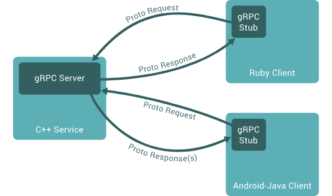

# What is gRPC?

- gRPC is high performance open source feature
- It is developed by Google but it is now part of Cloud Native Computing Foundation (CNCF)
- g stands for various name in each realease
- you can check here : https://github.com/grpc/grpc/blob/master/doc/g_stands_for.md

- RPC stands for Remote Procedure Call
  - It is protocol that allow program to
    - execute the procedure of another program located in another program
    - Without the developer explicitely coding the details for the remote interaction
    - In the client code it is like we are just calling the server side code only
    - And it is works even though the both client code and server code are written in different language

# How gRPC works ?

- 
- 1. Client generated the stubs that provides the same method as server
- 2. Stubs call the gRPC frameworks under the hood to exchange the informatio over network
- 3. Client and Server use stubs to interact with each other only thing to implement the core logic service code

# gRPC ProtoBuf & HTTP/2

- gRPC works the ProtoBuf to generate the stubs
- gRPC use HTTP version 2 as its Transfer Protocol
- HTTP provides some useful feature like :
  1. Binary Framing :
  - Lighter to transform and easy to decode
  - Great Combination with protocol buffer
  2. Header Compression using HPACK
  - Reduce Overhead and improve performance
  3. Multiplexing
  - Send multiple request and response in parallel over single TCP connection
  - Reduce latency and improve network utilization
  4. Server Push
  - one client request , multiple response
  - reduce round trip latency

# Types of gRPC ?

1. Unary

   - One Request,One Response

2. Client Streaming

   - Multiple Requests from client to server and one response from server to client

3. Server Streaming

   - One request from client mutlipel responses from the server

4. Bidirectional Streaming
   - Mutiple request,multiple response

# Features of gRPC :

1.HTTP/2 (fast) as a Protocol
2.ProtoBuf (binary & small ) for payload
3.Strict and required api contract in gRPC
4.Built in code generation
5.Security ( TLS/SSL)
6.Bidirectional Streaming
